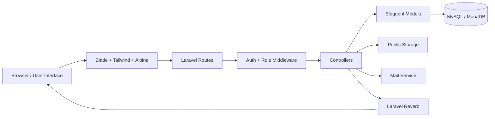

# 🌱 EcoDrop

**♻️ Platform Manajemen Sampah Berbasis Reward dengan Multi-Role Dashboard dan Real-Time Chat**

EcoDrop adalah aplikasi web untuk membantu proses pengajuan, verifikasi, dan monitoring setoran sampah secara digital. Aplikasi ini dirancang untuk mendorong kebiasaan ramah lingkungan melalui sistem poin reward, dashboard berbasis role, verifikasi admin, activity log, OTP authentication, upload foto, dan fitur chat real-time antara user dan admin.

<p align="center">
  
  
  
  
  
</p>

---

## 📚 Daftar Isi

- [📌 Tentang Project](#tentang-project)
- [✨ Fitur Utama](#fitur-utama)
- [🧩 Role dan Hak Akses](#role-dan-hak-akses)
- [🛠️ Tech Stack](#tech-stack)
- [🏗️ Arsitektur Singkat](#arsitektur-singkat)
- [🗄️ Struktur Database Inti](#struktur-database-inti)
- [⚙️ Instalasi](#instalasi)
- [🚀 Menjalankan Project](#menjalankan-project)
- [🔐 Akun Demo](#akun-demo)
- [🔄 Alur Penggunaan](#alur-penggunaan)
- [📁 Struktur Project](#struktur-project)
- [🧪 Testing](#testing)
- [🩺 Troubleshooting](#troubleshooting)
- [👥 Tim Pengembang](#tim-pengembang)
- [📄 Lisensi](#lisensi)
- [📞 Kontak dan Support](#kontak-dan-support)

---

## 📌 Tentang Project

EcoDrop dibuat sebagai project web development untuk mendigitalisasi alur pengelolaan sampah. Pada sistem manual, proses pencatatan setoran sering tidak rapi, status verifikasi sulit dipantau, komunikasi user dan petugas tercecer di aplikasi lain, serta pemberian poin reward kurang transparan.

Melalui EcoDrop, user dapat mengajukan setoran sampah lengkap dengan jenis sampah, berat, tanggal penjemputan, alamat, nomor telepon, foto bukti, catatan, dan lokasi. Admin dapat memverifikasi setoran, memberikan poin, menolak data yang tidak valid, serta menangani pertanyaan user melalui chat. Super admin dapat mengawasi keseluruhan sistem, memverifikasi admin baru, memantau activity log, dan mengelola user.

Tujuan utama EcoDrop:

- Mendorong kebiasaan memilah dan menyetor sampah.
- Memberikan reward berupa poin kepada user yang aktif.
- Membuat proses verifikasi setoran lebih transparan.
- Memudahkan komunikasi user dan admin melalui real-time chat.
- Menyediakan dashboard monitoring untuk admin dan super admin.

---

## ✨ Fitur Utama

### 👤 User

- Register dan login menggunakan OTP email.
- Dashboard user dengan ringkasan poin dan riwayat setoran.
- Pengajuan setoran sampah baru.
- Upload foto sampah sebagai bukti setoran.
- Input alamat, nomor telepon, tanggal penjemputan, catatan, dan lokasi.
- Melihat status setoran: `pending`, `approved`, atau `rejected`.
- Membatalkan setoran yang masih pending.
- Edit profile dan update foto profil.
- Crop dan atur posisi foto profil sebelum disimpan.
- Chat real-time dengan admin.

### 🛡️ Admin

- Login khusus admin dengan OTP email.
- Hanya admin yang sudah diverifikasi super admin yang dapat masuk dashboard.
- Dashboard monitoring seluruh setoran user.
- Filter data setoran berdasarkan status, jenis, dan tanggal.
- Melihat detail setoran, foto user, foto sampah, lokasi, alamat, dan catatan.
- Approve setoran dan memberikan poin reward.
- Reject setoran yang tidak valid.
- Hapus data setoran jika diperlukan.
- Menangani chat user melalui floating chat widget.
- Race condition protection agar satu chat tidak diambil dua admin bersamaan.
- Activity log otomatis ketika melakukan approve, reject, atau delete setoran.

### 👑 Super Admin

- Dashboard monitoring sistem secara keseluruhan.
- Melihat daftar admin pending dan admin verified.
- Verifikasi akun admin baru.
- Mengirim email notifikasi saat admin berhasil diverifikasi.
- Hapus akun admin.
- Melihat daftar user.
- Ban atau unban user.
- Melihat semua setoran dan activity log admin.
- Memantau chat dan aktivitas layanan.

### 💬 Real-Time Chat

- Conversation antara user dan admin.
- Pesan real-time menggunakan Laravel Reverb dan Laravel Echo.
- Unread message count.
- Pickup card otomatis saat user membuat setoran.
- System message otomatis saat setoran disetujui atau ditolak.
- Admin dapat mengambil atau menangani conversation.
- Admin dapat menutup sesi layanan.
- User dapat membuka kembali sesi chat dengan mengirim pesan baru.

---

## 🧩 Role dan Hak Akses

| Role | Akses Utama | Keterangan |
|---|---|---|
| `user` | Dashboard user, pengajuan setoran, riwayat, profile, chat | Role default setelah register |
| `admin` | Dashboard admin, verifikasi setoran, chat, activity handling | Harus diverifikasi super admin |
| `super_admin` | Semua fitur admin, verifikasi admin, ban user, activity log | Role tertinggi dalam sistem |

Proteksi akses dilakukan menggunakan middleware `auth` dan `role`.

---

## 🛠️ Tech Stack

| Layer | Teknologi |
|---|---|
| Backend | PHP 8.2+, Laravel 12 |
| Frontend | Blade, Tailwind CSS, Alpine.js |
| Authentication | Laravel Breeze, Session Auth, OTP Email |
| Database | MySQL atau MariaDB |
| ORM | Laravel Eloquent |
| Realtime | Laravel Reverb, Laravel Echo, Pusher JS |
| Mail | Laravel Mailable, Queue |
| File Upload | Laravel Storage public disk |
| Build Tool | Vite |
| Testing | PHPUnit |
| Package Manager | Composer, npm |
| Version Control | Git, GitHub |

---

## 🏗️ Arsitektur Singkat

EcoDrop menggunakan arsitektur MVC bawaan Laravel.



---

## 🗄️ Struktur Database Inti

| Tabel | Fungsi |
|---|---|
| `users` | Menyimpan akun user, admin, super admin, role, poin, status verifikasi, status banned, dan foto profil |
| `pickups` | Menyimpan data setoran sampah user |
| `activity_logs` | Mencatat aktivitas admin saat approve, reject, atau delete setoran |
| `conversations` | Menyimpan room chat antara user dan admin |
| `conversation_messages` | Menyimpan pesan chat real-time |
| `otp_codes` | Menyimpan kode OTP untuk login dan forgot password |
| `messages` | Chat lama berbasis pickup untuk backward compatibility |
| `rewards` | Rancangan data reward atau hadiah |

Relasi penting:

- User memiliki banyak pickup.
- Pickup dimiliki oleh user dan dapat ditangani oleh admin.
- Conversation dimiliki oleh user dan dapat di-assign ke admin.
- Conversation memiliki banyak conversation message.
- Activity log dibuat oleh admin dan dapat terhubung ke pickup.

---

## ⚙️ Instalasi

### 📋 Prasyarat

Pastikan sudah terinstall:

- PHP 8.2 atau lebih baru
- Composer
- Node.js dan npm
- MySQL atau MariaDB
- Git

### 1. Clone Repository

```bash
git clone https://github.com/YogUNI/EcoDrop.git
cd EcoDrop
```

Jika folder project lokal bernama `ecodrop-web`, masuk ke folder tersebut:

```bash
cd ecodrop-web
```

### 2. Install Dependency

```bash
composer install
npm install
```

### 3. Setup Environment

```bash
cp .env.example .env
php artisan key:generate
```

Untuk Windows PowerShell, jika `cp` tidak tersedia:

```powershell
Copy-Item .env.example .env
php artisan key:generate
```

### 4. Konfigurasi `.env`

Contoh konfigurasi database:

```env
APP_NAME=EcoDrop
APP_URL=http://localhost:8000

DB_CONNECTION=mysql
DB_HOST=127.0.0.1
DB_PORT=3306
DB_DATABASE=ecodrop
DB_USERNAME=root
DB_PASSWORD=

QUEUE_CONNECTION=database
SESSION_DRIVER=database
FILESYSTEM_DISK=public
```

Contoh konfigurasi email untuk OTP:

```env
MAIL_MAILER=smtp
MAIL_HOST=sandbox.smtp.mailtrap.io
MAIL_PORT=2525
MAIL_USERNAME=your_mailtrap_username
MAIL_PASSWORD=your_mailtrap_password
MAIL_FROM_ADDRESS="noreply@ecodrop.test"
MAIL_FROM_NAME="EcoDrop"
```

Untuk development tanpa SMTP, bisa gunakan:

```env
MAIL_MAILER=log
```

Jika memakai `MAIL_MAILER=log`, kode OTP dapat dilihat di:

```text
storage/logs/laravel.log
```

### 5. Konfigurasi Realtime Chat

Untuk mengaktifkan chat real-time dengan Laravel Reverb:

```env
BROADCAST_CONNECTION=reverb

REVERB_APP_ID=ecodrop-local
REVERB_APP_KEY=ecodrop-key
REVERB_APP_SECRET=ecodrop-secret
REVERB_HOST=127.0.0.1
REVERB_PORT=8080
REVERB_SCHEME=http

VITE_REVERB_APP_KEY="${REVERB_APP_KEY}"
VITE_REVERB_HOST="${REVERB_HOST}"
VITE_REVERB_PORT="${REVERB_PORT}"
VITE_REVERB_SCHEME="${REVERB_SCHEME}"
```

### 6. Migrasi Database dan Seeder

```bash
php artisan migrate:fresh --seed
```

### 7. Buat Storage Link

Wajib untuk menampilkan foto profil dan foto setoran:

```bash
php artisan storage:link
```

### 8. Build atau Jalankan Asset Frontend

Untuk development:

```bash
npm run dev
```

Untuk production build:

```bash
npm run build
```

---

## 🚀 Menjalankan Project

Jalankan beberapa terminal berikut saat development.

### Terminal 1 - Laravel Server

```bash
php artisan serve
```

Akses aplikasi:

```text
http://localhost:8000
```

### Terminal 2 - Vite

```bash
npm run dev
```

### Terminal 3 - Queue Worker

Digunakan untuk email queue, termasuk notifikasi verifikasi admin.

```bash
php artisan queue:work
```

### Terminal 4 - Laravel Reverb

Digunakan untuk chat real-time.

```bash
php artisan reverb:start
```

Alternatif development command dari Composer:

```bash
composer run dev
```

---

## 🔐 Akun Demo

Akun yang dibuat oleh seeder:

| Role | Email | Password | Catatan |
|---|---|---|---|
| Super Admin | `superadmin@ecodrop.com` | `password123` | Dibuat oleh `SuperAdminSeeder` |
| User | `test@example.com` | `password` | Dibuat oleh `UserFactory` |

Untuk akun admin:

1. Buka `/admin/register`.
2. Daftarkan akun admin baru.
3. Login sebagai super admin.
4. Verifikasi admin melalui dashboard super admin.
5. Admin dapat login melalui `/admin/login`.

Catatan: karena login menggunakan OTP, pastikan konfigurasi mail sudah benar atau gunakan `MAIL_MAILER=log`.

---

## 🔄 Alur Penggunaan

### 👤 User Flow

1. User register atau login.
2. Sistem mengirim OTP ke email.
3. User memasukkan OTP.
4. User masuk dashboard.
5. User mengajukan setoran sampah.
6. Sistem menyimpan setoran dengan status `pending`.
7. Sistem otomatis mengirim pickup card ke chat.
8. User menunggu verifikasi admin.

### 🛡️ Admin Flow

1. Admin register melalui halaman admin.
2. Super admin memverifikasi akun admin.
3. Admin login dan OTP.
4. Admin melihat setoran pending.
5. Admin approve atau reject setoran.
6. Jika approved, poin user bertambah.
7. Activity log otomatis tercatat.
8. System message dikirim ke chat user.

### 👑 Super Admin Flow

1. Super admin login.
2. Super admin melihat dashboard monitoring.
3. Super admin memverifikasi admin baru.
4. Super admin dapat menghapus admin.
5. Super admin dapat ban atau unban user.
6. Super admin memantau activity log.

---

## 📁 Struktur Project

```text
ecodrop-web/
├── app/
│   ├── Events/
│   ├── Http/
│   │   ├── Controllers/
│   │   ├── Middleware/
│   │   └── Requests/
│   ├── Mail/
│   └── Models/
├── database/
│   ├── migrations/
│   ├── seeders/
│   └── factories/
├── resources/
│   ├── css/
│   ├── js/
│   └── views/
│       ├── admin/
│       ├── auth/
│       ├── components/
│       ├── layouts/
│       ├── profile/
│       └── superadmin/
├── routes/
│   ├── auth.php
│   ├── channels.php
│   └── web.php
├── tests/
├── composer.json
├── package.json
└── vite.config.js
```

---

## 🧪 Testing

Jalankan test menggunakan:

```bash
php artisan test
```

Test bawaan yang tersedia meliputi authentication, registration, password reset, email verification, dan profile.

Rekomendasi test tambahan:

- User dapat membuat pickup valid.
- User tidak dapat membatalkan pickup yang sudah approved.
- Admin dapat approve pickup dan poin user bertambah.
- Admin dapat reject pickup.
- Super admin dapat verify admin.
- Super admin dapat ban user.
- User dapat mengirim pesan chat.
- Admin dapat handle conversation.

---

## 🩺 Troubleshooting

### 📸 Foto tidak muncul

Pastikan sudah menjalankan:

```bash
php artisan storage:link
```

### 📧 OTP tidak masuk email

Gunakan `MAIL_MAILER=log`, lalu cek:

```text
storage/logs/laravel.log
```

### 💬 Chat real-time tidak berjalan

Pastikan:

1. `.env` sudah memakai `BROADCAST_CONNECTION=reverb`.
2. `php artisan reverb:start` sedang berjalan.
3. `npm run dev` sedang berjalan.
4. Variable `VITE_REVERB_*` sudah sesuai.

### 🧹 Perubahan Blade tidak tampil

Bersihkan cache view:

```bash
php artisan view:clear
php artisan cache:clear
```

---

## 👥 Tim Pengembang

| Nama | Role | GitHub |
|---|---|---|
| Yoga Gusti R | Full Stack Developer | [@YogUNI](https://github.com/YogUNI) |
| M Vicky Haikal | Frontend Developer | [@MhmmdVckyHaikal](https://github.com/MhmmdVckyHaikal) |
| Thomas Setiawan | UI/UX Designer | [@Thvmxxs](https://github.com/Thvmxxs) |

---

## 📄 Lisensi

Project ini menggunakan lisensi [MIT](LICENSE).

---

## 📞 Kontak dan Support

Jika menemukan bug atau memiliki saran pengembangan, silakan buat issue pada repository GitHub atau hubungi tim pengembang.

🌱 **EcoDrop - Waste to Worth.**
