# LAPORAN PROJECT ECODROP

Platform Manajemen Sampah Berbasis Reward

Kelompok: KELOMPOK 3  
Mata Kuliah: Pemrograman Web  
Framework: Laravel, Tailwind CSS, Alpine.js  

---

## DAFTAR ISI

BAB I PENDAHULUAN  
1.1 Latar Belakang  
1.2 Rumusan Masalah  
1.3 Filosofi EcoDrop  
1.4 Batasan Masalah atau Scope  
1.5 Tujuan Project  
1.6 Manfaat  
1.7 Target Pengguna  

BAB II PLANNING  
2.1 Analisis Kebutuhan  
2.2 Use Case Diagram  
2.3 User Story  
2.4 Kebutuhan Fungsional  
2.5 Kebutuhan Non Fungsional  

BAB III PERANCANGAN SISTEM  
3.1 Arsitektur Sistem  
3.2 Physical ERD atau Database Schema  
3.3 Struktur Database Laravel Migration dan Eloquent Schema  
3.4 Jenis Relasi  
3.5 Indexing  
3.6 Flowchart  
3.7 Package Diagram  
3.8 Component Diagram  
3.9 Class Diagram  
3.10 Activity Diagram  
3.11 Sequence Diagram  
3.12 Referensi User Interface  
3.13 Tech Stack  

BAB IV IMPLEMENTASI  
4.1 Struktur Project  
4.2 Lingkungan Pengembangan  
4.3 Screenshot Commit dan Repository  
4.4 Screenshot Web App  
4.5 Unit Testing  
4.6 Team Development  

BAB V PENUTUP  
5.1 Kesimpulan  
5.2 Saran Pengembangan  

---

# BAB I
# PENDAHULUAN

## 1.1 Latar Belakang

Permasalahan sampah masih menjadi salah satu masalah lingkungan yang sering ditemui dalam kehidupan sehari-hari. Banyak masyarakat yang belum memiliki kebiasaan memilah, mencatat, dan menyetorkan sampah secara teratur. Di sisi lain, proses pengumpulan sampah yang masih dilakukan secara manual sering menimbulkan kendala seperti pencatatan yang tidak rapi, data setoran yang mudah hilang, proses verifikasi yang lambat, kurangnya transparansi pemberian poin, dan sulitnya komunikasi antara masyarakat dengan petugas.

Perkembangan teknologi web memberikan peluang untuk membuat sistem digital yang lebih terstruktur. Dengan aplikasi berbasis web, masyarakat dapat mengajukan setoran sampah, mengunggah bukti foto, mencatat lokasi dan tanggal penjemputan, memantau status setoran, serta memperoleh poin reward setelah setoran diverifikasi. Petugas atau admin juga dapat melihat semua pengajuan, melakukan verifikasi, memberikan poin, menolak setoran jika data tidak valid, dan mencatat setiap aktivitas ke dalam sistem.

EcoDrop dikembangkan sebagai platform manajemen sampah berbasis reward. Aplikasi ini dirancang untuk menghubungkan pengguna, admin, dan super admin dalam satu sistem terpadu. Pengguna dapat melakukan pengajuan setoran sampah secara mandiri, admin bertugas memverifikasi setoran, sedangkan super admin bertugas mengawasi keseluruhan sistem, memverifikasi akun admin, mengelola user, dan melihat activity log.

Selain fitur pengelolaan setoran, EcoDrop juga memiliki fitur chat real-time. Fitur ini dibuat agar komunikasi antara user dan admin tidak harus dilakukan melalui aplikasi lain. User dapat bertanya atau menyampaikan kendala langsung dari aplikasi, sedangkan admin dapat menangani percakapan secara terstruktur. Sistem chat juga memiliki konsep conversation, unread message, pickup card, session close, dan race condition protection agar satu percakapan tidak diambil oleh dua admin secara bersamaan.

Dengan demikian, EcoDrop bukan hanya aplikasi pencatatan sampah, tetapi juga sistem digital yang mendorong kesadaran lingkungan, transparansi data, efisiensi kerja admin, serta pengalaman pengguna yang lebih baik.

## 1.2 Rumusan Masalah

Berdasarkan latar belakang di atas, rumusan masalah pada project EcoDrop adalah sebagai berikut:

1. Bagaimana membuat aplikasi web yang dapat membantu user mengajukan setoran sampah secara digital?
2. Bagaimana membuat sistem verifikasi setoran sampah oleh admin agar status setoran dapat dipantau dengan jelas?
3. Bagaimana menerapkan sistem poin reward agar user termotivasi untuk mengelola sampah?
4. Bagaimana membuat dashboard berbeda sesuai role user, admin, dan super admin?
5. Bagaimana membangun sistem autentikasi yang lebih aman menggunakan login, OTP, role, verifikasi admin, dan banned user?
6. Bagaimana menyediakan fitur komunikasi real-time antara user dan admin?
7. Bagaimana mencatat aktivitas admin agar proses verifikasi lebih transparan dan dapat diaudit?
8. Bagaimana membuat tampilan aplikasi yang responsif, mudah digunakan, dan nyaman diakses dari perangkat desktop maupun mobile?

## 1.3 Filosofi EcoDrop

Nama EcoDrop terdiri dari dua kata utama, yaitu "Eco" dan "Drop".

"Eco" menggambarkan kepedulian terhadap lingkungan, keberlanjutan, kebersihan, dan kebiasaan hidup yang lebih ramah lingkungan. Bagian ini merepresentasikan tujuan utama aplikasi, yaitu membantu masyarakat mengelola sampah dengan cara yang lebih baik.

"Drop" menggambarkan aktivitas menyetorkan atau menyerahkan sampah. Dalam konteks aplikasi, drop berarti user dapat mengajukan setoran sampah melalui sistem, mencatat data sampah, mengunggah foto, dan menunggu proses verifikasi admin.

Filosofi utama EcoDrop adalah mengubah aktivitas sederhana seperti menyetorkan sampah menjadi proses digital yang bernilai. Sampah yang sebelumnya sering dianggap tidak berguna dapat diolah menjadi data, poin, reward, dan kontribusi lingkungan.

Nilai utama yang dibawa EcoDrop adalah:

1. Environmental awareness: mendorong masyarakat lebih sadar terhadap pengelolaan sampah.
2. Transparency: semua setoran, status, poin, dan aktivitas admin tercatat secara digital.
3. Efficiency: proses pengajuan dan verifikasi dilakukan lebih cepat dibanding pencatatan manual.
4. Accountability: setiap keputusan approve, reject, atau delete tercatat pada activity log.
5. Engagement: sistem poin dan reward meningkatkan motivasi user untuk aktif menyetor sampah.
6. Communication: chat real-time memudahkan user dan admin berkomunikasi dalam satu platform.

## 1.4 Batasan Masalah atau Scope

Agar pengembangan lebih terarah, project EcoDrop memiliki batasan masalah sebagai berikut:

1. Aplikasi berbasis web dan dikembangkan menggunakan Laravel.
2. Sistem menggunakan autentikasi berbasis session Laravel Breeze.
3. Role yang digunakan terdiri dari user, admin, dan super_admin.
4. User dapat mendaftar, login, verifikasi OTP, mengedit profil, mengunggah foto profil, mengajukan setoran sampah, melihat riwayat, dan menggunakan chat.
5. Admin dapat login melalui halaman admin, melakukan OTP, melihat dashboard admin, memverifikasi setoran, menghapus data setoran, dan menangani chat user.
6. Super admin dapat memverifikasi admin baru, menghapus admin, ban atau unban user, melihat data setoran, melihat activity log, dan memantau sistem.
7. Sistem reward yang sudah diterapkan adalah penambahan poin ketika setoran disetujui.
8. Modul penukaran reward masih berupa rancangan database dan belum menjadi fitur transaksi penukaran lengkap.
9. Sistem lokasi setoran menyimpan latitude dan longitude, tetapi integrasi peta dapat dikembangkan lebih lanjut.
10. Sistem chat menggunakan Laravel Reverb, Laravel Echo, dan event broadcasting.
11. Aplikasi belum mencakup integrasi pembayaran digital, kurir eksternal, atau IoT smart bin.

## 1.5 Tujuan Project

Tujuan dari project EcoDrop adalah:

1. Membuat aplikasi manajemen sampah berbasis web yang mudah digunakan oleh masyarakat.
2. Menerapkan sistem pengajuan setoran sampah lengkap dengan jenis sampah, berat, tanggal, alamat, nomor telepon, foto, catatan, dan lokasi.
3. Membuat fitur verifikasi setoran oleh admin dengan status pending, approved, dan rejected.
4. Memberikan poin reward kepada user setelah setoran disetujui.
5. Membuat dashboard role-based untuk user, admin, dan super admin.
6. Menerapkan keamanan autentikasi menggunakan login, OTP, role middleware, banned user, dan verifikasi admin.
7. Membuat fitur real-time chat agar user dapat berkomunikasi dengan admin.
8. Mencatat aktivitas admin pada activity log agar sistem lebih transparan.
9. Membuat UI aplikasi yang modern, responsif, dan mudah dipahami.
10. Menjadi project pembelajaran full-stack web development menggunakan Laravel, Blade, Tailwind CSS, Alpine.js, dan MySQL.

## 1.6 Manfaat

Manfaat bagi user:

1. User dapat mengajukan setoran sampah tanpa pencatatan manual.
2. User dapat melihat status setoran secara jelas.
3. User mendapatkan poin reward dari setoran yang disetujui.
4. User dapat berkomunikasi langsung dengan admin melalui chat.
5. User dapat mengelola profil dan foto profil.

Manfaat bagi admin:

1. Admin dapat melihat seluruh pengajuan setoran dalam satu dashboard.
2. Admin dapat memverifikasi setoran dengan lebih cepat.
3. Admin dapat melihat detail user, foto setoran, lokasi, dan catatan.
4. Admin dapat menangani pertanyaan user melalui chat.
5. Admin tidak perlu mencatat aktivitas secara manual karena sistem membuat activity log.

Manfaat bagi super admin:

1. Super admin dapat mengontrol akun admin yang boleh aktif.
2. Super admin dapat memantau semua setoran dan aktivitas admin.
3. Super admin dapat ban atau unban user yang melanggar.
4. Super admin dapat mengawasi performa sistem secara keseluruhan.

Manfaat bagi lingkungan:

1. Membantu meningkatkan budaya memilah dan menyetor sampah.
2. Mendorong pengelolaan sampah yang lebih terdata.
3. Memberikan insentif kepada masyarakat agar lebih aktif menjaga lingkungan.

## 1.7 Target Pengguna

Target pengguna EcoDrop adalah:

1. Masyarakat umum yang ingin menyetorkan sampah dan memperoleh poin reward.
2. Petugas pengelola sampah atau admin yang bertugas memverifikasi setoran.
3. Pengelola sistem atau super admin yang bertugas mengawasi admin, user, dan data setoran.
4. Komunitas, sekolah, kampus, bank sampah, atau organisasi lingkungan yang membutuhkan sistem pencatatan setoran sampah.

---

# BAB II
# PLANNING

## 2.1 Analisis Kebutuhan

### 2.1.1 Kebutuhan Pengguna User

User membutuhkan sistem yang dapat:

1. Melakukan registrasi akun.
2. Melakukan login dengan OTP.
3. Mengelola data profil dan foto profil.
4. Mengajukan setoran sampah.
5. Mengisi jenis sampah, berat, tanggal, alamat, nomor telepon, foto, catatan, dan lokasi.
6. Melihat riwayat setoran.
7. Membatalkan setoran jika status masih pending.
8. Melihat poin yang diperoleh.
9. Melakukan chat dengan admin.
10. Melihat notifikasi atau badge pesan belum dibaca.

### 2.1.2 Kebutuhan Admin

Admin membutuhkan sistem yang dapat:

1. Login melalui portal admin.
2. Verifikasi OTP admin.
3. Mengakses dashboard admin setelah diverifikasi super admin.
4. Melihat seluruh setoran user.
5. Melakukan filtering data setoran berdasarkan status, jenis sampah, dan tanggal.
6. Melihat detail setoran beserta foto, data user, alamat, lokasi, dan catatan.
7. Approve setoran dan memberikan poin.
8. Reject setoran jika data tidak valid.
9. Menghapus setoran jika diperlukan.
10. Menangani chat user.
11. Mengakhiri sesi layanan chat.

### 2.1.3 Kebutuhan Super Admin

Super admin membutuhkan sistem yang dapat:

1. Login dan OTP sebagai super admin.
2. Melihat dashboard monitoring sistem.
3. Melihat admin yang belum diverifikasi.
4. Memverifikasi akun admin baru.
5. Menghapus akun admin.
6. Melihat semua user.
7. Ban atau unban user.
8. Melihat semua setoran sampah.
9. Melihat activity log admin.
10. Mengawasi percakapan chat secara global.

### 2.1.4 Kebutuhan Sistem

Sistem membutuhkan:

1. Database untuk menyimpan user, setoran, reward, OTP, chat, dan activity log.
2. Middleware untuk membatasi akses berdasarkan role.
3. File storage untuk foto profil dan foto setoran.
4. Email service untuk OTP dan notifikasi verifikasi admin.
5. Realtime broadcasting untuk fitur chat.
6. UI responsif untuk desktop dan mobile.

## 2.2 Use Case Diagram

Use case berikut menggambarkan hubungan antara aktor dengan fitur utama EcoDrop.

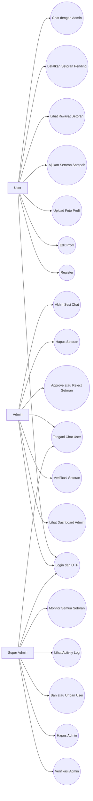

## 2.3 User Story

### User

1. Sebagai user, saya ingin mendaftar akun agar dapat menggunakan EcoDrop.
2. Sebagai user, saya ingin login menggunakan OTP agar akun saya lebih aman.
3. Sebagai user, saya ingin mengedit profil agar data saya selalu terbaru.
4. Sebagai user, saya ingin mengunggah dan mengatur foto profil agar identitas akun terlihat jelas.
5. Sebagai user, saya ingin mengajukan setoran sampah agar sampah saya dapat diproses oleh admin.
6. Sebagai user, saya ingin mengunggah foto sampah agar admin dapat memvalidasi bukti setoran.
7. Sebagai user, saya ingin melihat status setoran agar mengetahui apakah setoran saya pending, disetujui, atau ditolak.
8. Sebagai user, saya ingin mendapatkan poin jika setoran disetujui agar saya termotivasi mengelola sampah.
9. Sebagai user, saya ingin membatalkan setoran pending jika ada kesalahan data.
10. Sebagai user, saya ingin chat dengan admin agar dapat bertanya atau menyampaikan kendala.

### Admin

1. Sebagai admin, saya ingin login melalui portal admin agar dapat mengakses fitur pengelolaan.
2. Sebagai admin, saya ingin akun saya diverifikasi super admin agar sistem lebih aman.
3. Sebagai admin, saya ingin melihat semua setoran agar dapat memproses pengajuan user.
4. Sebagai admin, saya ingin melihat detail setoran agar dapat mengambil keputusan yang tepat.
5. Sebagai admin, saya ingin approve setoran dan memasukkan poin agar user mendapatkan reward.
6. Sebagai admin, saya ingin reject setoran jika data tidak valid.
7. Sebagai admin, saya ingin menghapus setoran jika diperlukan.
8. Sebagai admin, saya ingin menangani chat user agar komunikasi lebih cepat.
9. Sebagai admin, saya ingin sistem mencegah dua admin mengambil chat yang sama agar tidak terjadi konflik kerja.

### Super Admin

1. Sebagai super admin, saya ingin melihat admin yang mendaftar agar dapat diverifikasi.
2. Sebagai super admin, saya ingin memverifikasi admin agar hanya admin valid yang dapat masuk.
3. Sebagai super admin, saya ingin melihat semua user agar dapat mengawasi pengguna.
4. Sebagai super admin, saya ingin ban atau unban user agar sistem tetap aman.
5. Sebagai super admin, saya ingin melihat activity log agar aktivitas admin dapat diaudit.
6. Sebagai super admin, saya ingin memantau semua setoran agar kondisi sistem dapat diketahui.

## 2.4 Kebutuhan Fungsional

Kebutuhan fungsional EcoDrop:

1. Sistem dapat melakukan registrasi user.
2. Sistem dapat melakukan registrasi admin.
3. Sistem dapat melakukan login user, admin, dan super admin.
4. Sistem dapat mengirim OTP ke email.
5. Sistem dapat memverifikasi OTP login.
6. Sistem dapat melakukan reset password menggunakan OTP.
7. Sistem dapat membedakan akses berdasarkan role.
8. Sistem dapat menolak akses admin yang belum diverifikasi.
9. Sistem dapat logout otomatis user yang dibanned.
10. Sistem dapat menampilkan dashboard sesuai role.
11. Sistem dapat membuat data setoran sampah.
12. Sistem dapat mengunggah foto setoran.
13. Sistem dapat menyimpan latitude dan longitude setoran.
14. Sistem dapat menampilkan riwayat setoran user.
15. Sistem dapat membatalkan setoran pending.
16. Sistem dapat approve setoran dan menambahkan poin ke user.
17. Sistem dapat reject setoran.
18. Sistem dapat menghapus setoran.
19. Sistem dapat membuat activity log untuk aksi admin.
20. Sistem dapat mengirim notifikasi email saat admin diverifikasi.
21. Sistem dapat membuat conversation chat antara user dan admin.
22. Sistem dapat mengirim pesan text, system message, dan pickup card.
23. Sistem dapat menghitung unread message.
24. Sistem dapat menutup dan membuka kembali sesi chat.
25. Sistem dapat upload, crop, simpan, dan hapus foto profil.

## 2.5 Kebutuhan Non Fungsional

Kebutuhan non fungsional EcoDrop:

1. Security: sistem menggunakan password hashing, CSRF protection, middleware auth, role middleware, OTP, dan validasi input.
2. Reliability: data penting disimpan di database dan relasi menggunakan foreign key.
3. Usability: UI dibuat responsif dan mudah digunakan.
4. Maintainability: project menggunakan struktur Laravel MVC sehingga mudah dikembangkan.
5. Performance: data dashboard menggunakan eager loading pada relasi penting seperti user, handledBy, lastMessage, dan assignedAdmin.
6. Scalability: fitur chat dipisahkan ke conversation dan conversation_messages agar bisa dikembangkan menjadi sistem support yang lebih besar.
7. Auditability: setiap aksi verifikasi setoran dicatat pada activity_logs.
8. Accessibility: form memiliki label, validasi error, dan struktur tampilan yang jelas.
9. Compatibility: aplikasi berjalan di browser modern dan dapat diakses melalui desktop maupun mobile.

---

# BAB III
# PERANCANGAN SISTEM

## 3.1 Arsitektur Sistem

EcoDrop menggunakan arsitektur Model View Controller atau MVC dari Laravel.

1. Model bertanggung jawab terhadap representasi data dan relasi database. Contoh model: User, Pickup, Conversation, ConversationMessage, OtpCode, ActivityLog, Reward.
2. View bertanggung jawab menampilkan halaman aplikasi. EcoDrop menggunakan Blade template, Tailwind CSS, dan Alpine.js.
3. Controller bertanggung jawab menerima request, melakukan validasi, memproses business logic, memanggil model, dan mengembalikan response atau view.
4. Middleware digunakan untuk autentikasi, pembatasan role, update online status, dan proteksi akses.
5. Event broadcasting digunakan untuk fitur chat real-time.

Diagram arsitektur:

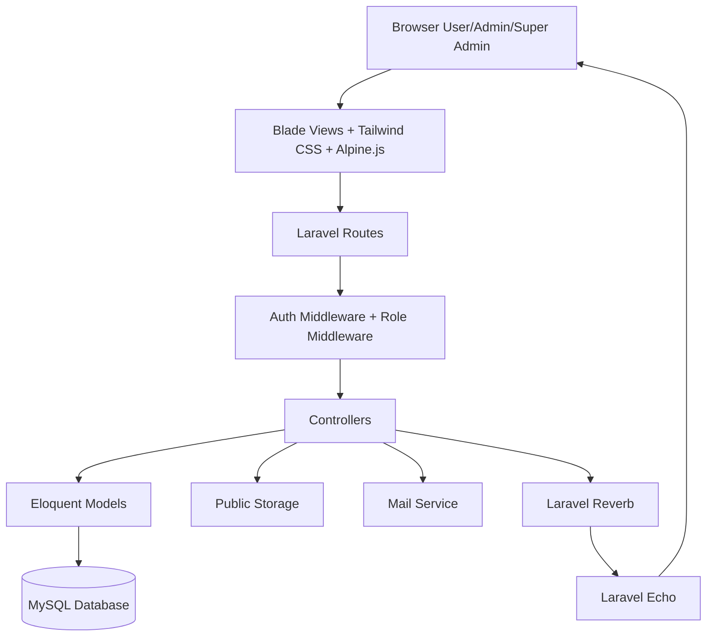

## 3.2 Physical ERD atau Database Schema

ERD utama EcoDrop:

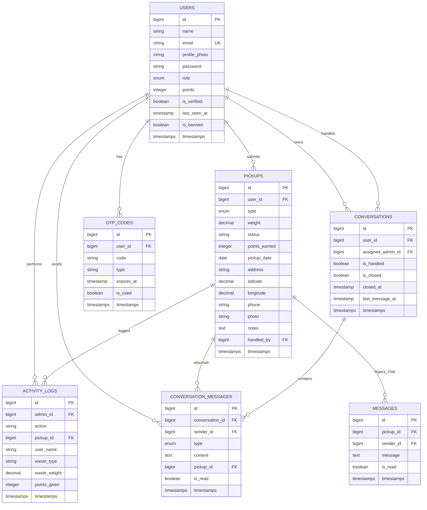

## 3.3 Struktur Database Laravel Migration dan Eloquent Schema

### 3.3.1 Tabel users

Tabel users menyimpan data akun user, admin, dan super admin.

| Kolom | Tipe | Keterangan |
|---|---|---|
| id | bigint | Primary key |
| name | string | Nama pengguna |
| email | string unique | Email login |
| profile_photo | string nullable | Path foto profil |
| email_verified_at | timestamp nullable | Verifikasi email Laravel |
| password | string | Password hash |
| role | enum | user, admin, super_admin |
| points | integer | Total poin user |
| is_verified | boolean | Status verifikasi admin |
| last_seen_at | timestamp nullable | Status online terakhir |
| is_banned | boolean | Status banned user |
| remember_token | string nullable | Remember me token |
| timestamps | timestamps | created_at dan updated_at |

### 3.3.2 Tabel pickups

Tabel pickups menyimpan data pengajuan setoran sampah.

| Kolom | Tipe | Keterangan |
|---|---|---|
| id | bigint | Primary key |
| user_id | foreignId | Pemilik setoran |
| type | enum/string | Jenis sampah |
| weight | decimal | Berat sampah |
| status | string | pending, approved, rejected |
| points_earned | integer | Poin dari setoran |
| pickup_date | date | Tanggal penjemputan |
| address | string | Alamat penjemputan |
| latitude | decimal nullable | Koordinat latitude |
| longitude | decimal nullable | Koordinat longitude |
| phone | string | Nomor telepon |
| photo | string nullable | Foto bukti sampah |
| notes | text nullable | Catatan tambahan |
| handled_by | foreignId nullable | Admin yang menangani |
| timestamps | timestamps | created_at dan updated_at |

Jenis sampah yang didukung:

1. Plastik
2. Kertas
3. Logam
4. Kaca
5. Organik
6. Elektronik
7. Lainnya

### 3.3.3 Tabel rewards

Tabel rewards disiapkan untuk data hadiah atau reward.

| Kolom | Tipe | Keterangan |
|---|---|---|
| id | bigint | Primary key |
| name | string | Nama reward |
| points_required | integer | Poin yang dibutuhkan |
| description | text nullable | Deskripsi reward |
| image | string nullable | Gambar reward |
| timestamps | timestamps | created_at dan updated_at |

### 3.3.4 Tabel activity_logs

Tabel activity_logs menyimpan jejak aktivitas admin terhadap setoran.

| Kolom | Tipe | Keterangan |
|---|---|---|
| id | bigint | Primary key |
| admin_id | foreignId | Admin yang melakukan aksi |
| action | string | approved, rejected, deleted |
| pickup_id | foreignId nullable | Setoran terkait |
| user_name | string | Nama user pemilik setoran |
| waste_type | string nullable | Jenis sampah |
| waste_weight | decimal nullable | Berat sampah |
| points_given | integer nullable | Poin yang diberikan |
| timestamps | timestamps | created_at dan updated_at |

### 3.3.5 Tabel conversations

Tabel conversations menyimpan ruang percakapan antara user dan admin.

| Kolom | Tipe | Keterangan |
|---|---|---|
| id | bigint | Primary key |
| user_id | foreignId | User pemilik conversation |
| assigned_admin_id | foreignId nullable | Admin yang menangani |
| is_handled | boolean | Apakah sudah diambil admin |
| is_closed | boolean | Apakah sesi sudah ditutup |
| closed_at | timestamp nullable | Waktu sesi ditutup |
| last_message_at | timestamp nullable | Waktu pesan terakhir |
| timestamps | timestamps | created_at dan updated_at |

### 3.3.6 Tabel conversation_messages

Tabel conversation_messages menyimpan pesan real-time.

| Kolom | Tipe | Keterangan |
|---|---|---|
| id | bigint | Primary key |
| conversation_id | foreignId | ID conversation |
| sender_id | foreignId | Pengirim pesan |
| type | enum | text, pickup_card, system |
| content | text | Isi pesan |
| pickup_id | foreignId nullable | Setoran terkait |
| is_read | boolean | Status terbaca |
| timestamps | timestamps | created_at dan updated_at |

### 3.3.7 Tabel otp_codes

Tabel otp_codes menyimpan kode OTP untuk login dan forgot password.

| Kolom | Tipe | Keterangan |
|---|---|---|
| id | bigint | Primary key |
| user_id | foreignId | Pemilik OTP |
| code | string(6) | Kode OTP |
| type | string | login atau forgot_password |
| expires_at | timestamp | Waktu kedaluwarsa |
| is_used | boolean | Status sudah dipakai |
| timestamps | timestamps | created_at dan updated_at |

### 3.3.8 Tabel messages

Tabel messages adalah fitur chat lama yang masih dipertahankan untuk backward compatibility.

| Kolom | Tipe | Keterangan |
|---|---|---|
| id | bigint | Primary key |
| pickup_id | foreignId | Setoran terkait |
| sender_id | foreignId | Pengirim |
| message | text | Isi pesan |
| is_read | boolean | Status dibaca |
| timestamps | timestamps | created_at dan updated_at |

## 3.4 Jenis Relasi

Relasi utama pada sistem EcoDrop:

1. User hasMany Pickup: satu user dapat membuat banyak setoran.
2. Pickup belongsTo User: satu setoran dimiliki oleh satu user.
3. Pickup belongsTo User as handledBy: satu setoran dapat ditangani oleh satu admin.
4. User hasMany ActivityLog as admin: satu admin dapat memiliki banyak log aktivitas.
5. ActivityLog belongsTo Pickup: satu log dapat terhubung ke satu setoran.
6. User hasMany OtpCode: satu user dapat memiliki banyak OTP.
7. User hasMany Conversation: satu user memiliki conversation dengan admin.
8. Conversation belongsTo User: satu conversation dimiliki oleh user.
9. Conversation belongsTo User as assignedAdmin: conversation dapat ditugaskan ke satu admin.
10. Conversation hasMany ConversationMessage: satu conversation memiliki banyak pesan.
11. ConversationMessage belongsTo User as sender: satu pesan dikirim oleh satu user/admin.
12. ConversationMessage belongsTo Pickup: pesan tipe pickup_card dapat terhubung ke satu pickup.
13. Pickup hasMany Message: relasi fitur chat lama berbasis pickup.

## 3.5 Indexing

Index yang sudah ada atau terbentuk dari migration:

1. users.id sebagai primary key.
2. users.email sebagai unique index untuk mencegah email ganda.
3. pickups.user_id sebagai foreign key index.
4. pickups.handled_by sebagai foreign key index.
5. activity_logs.admin_id sebagai foreign key index.
6. activity_logs.pickup_id sebagai foreign key index.
7. conversations.user_id sebagai foreign key index.
8. conversations.assigned_admin_id sebagai foreign key index.
9. conversation_messages.conversation_id sebagai foreign key index.
10. conversation_messages.sender_id sebagai foreign key index.
11. conversation_messages.pickup_id sebagai foreign key index.
12. otp_codes.user_id sebagai foreign key index.
13. sessions.user_id dan sessions.last_activity sebagai index bawaan Laravel.

Index tambahan yang direkomendasikan untuk pengembangan:

1. pickups.status untuk mempercepat filter status pending, approved, rejected.
2. pickups.pickup_date untuk filter tanggal.
3. conversations.last_message_at untuk sorting daftar chat.
4. conversation_messages.is_read untuk menghitung unread message.
5. otp_codes.type dan otp_codes.is_used untuk mempercepat pencarian OTP aktif.

## 3.6 Flowchart

### 3.6.1 Flow Login User dengan OTP

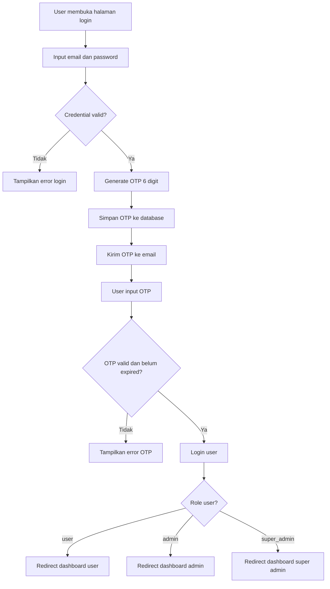

### 3.6.2 Flow Pengajuan Setoran Sampah

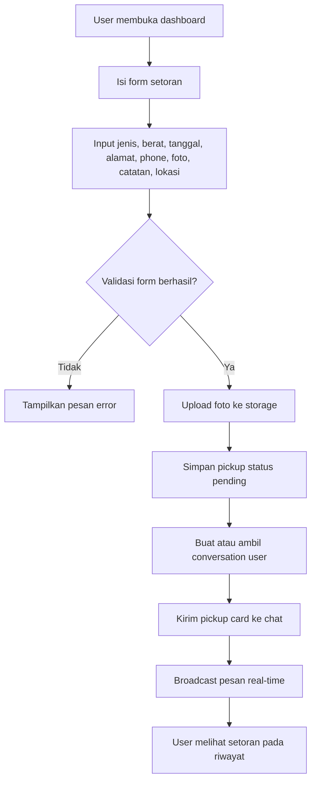

### 3.6.3 Flow Verifikasi Setoran oleh Admin

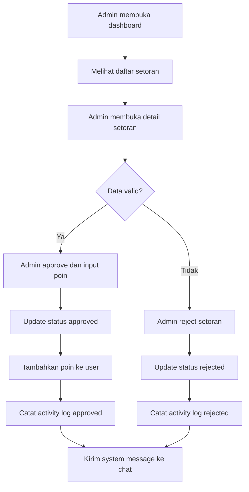

### 3.6.4 Flow Chat Real-Time

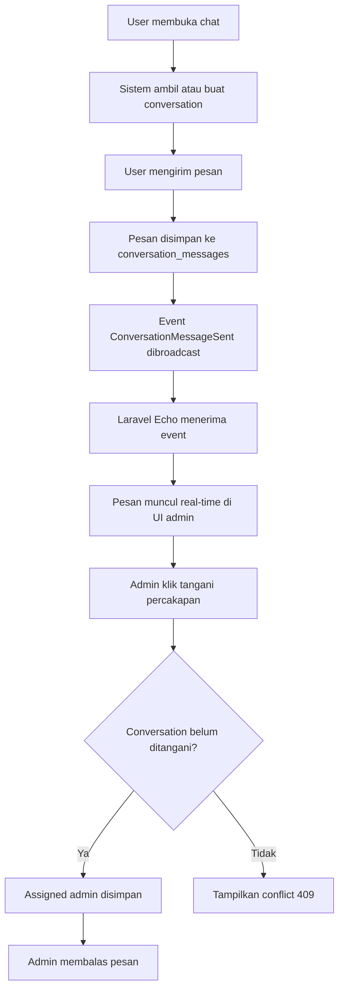

## 3.7 Package Diagram

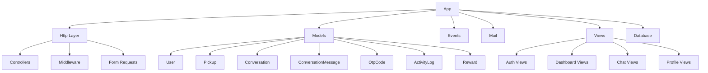

## 3.8 Component Diagram

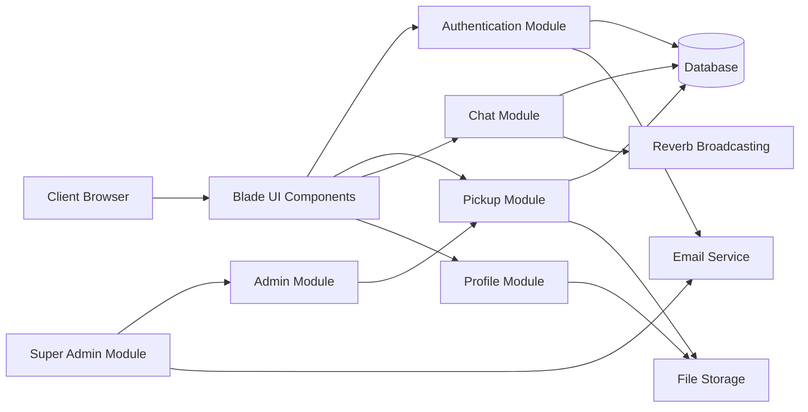

## 3.9 Class Diagram

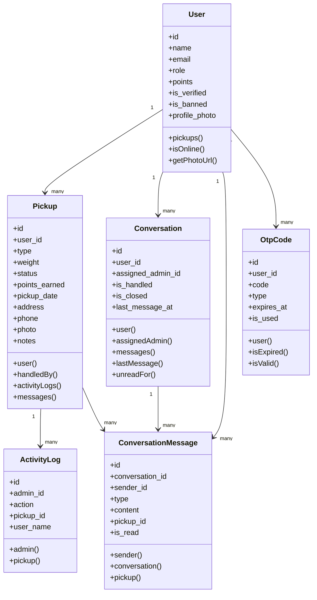

## 3.10 Activity Diagram

### 3.10.1 Activity User Mengajukan Setoran

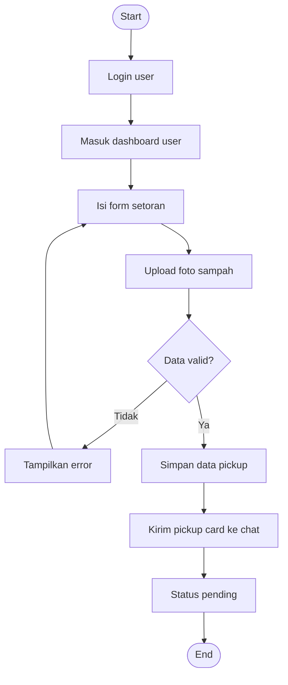

### 3.10.2 Activity Admin Memverifikasi Setoran

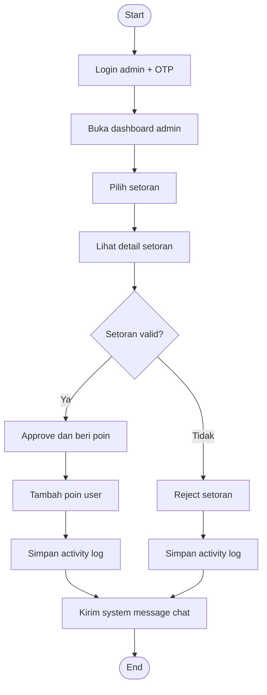

### 3.10.3 Activity Super Admin Memverifikasi Admin

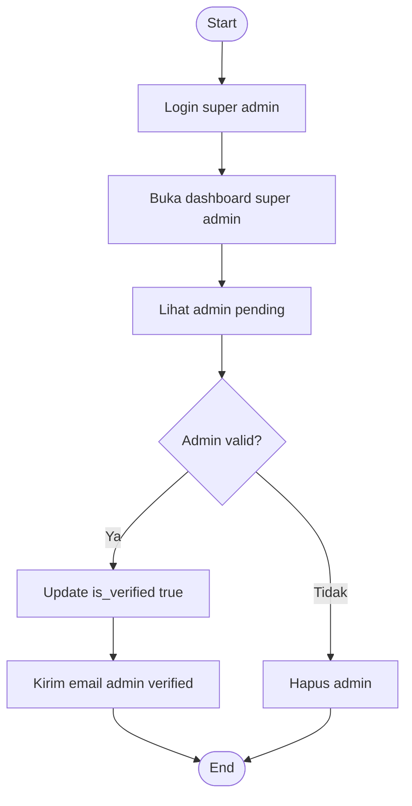

## 3.11 Sequence Diagram

### 3.11.1 Sequence Login dengan OTP

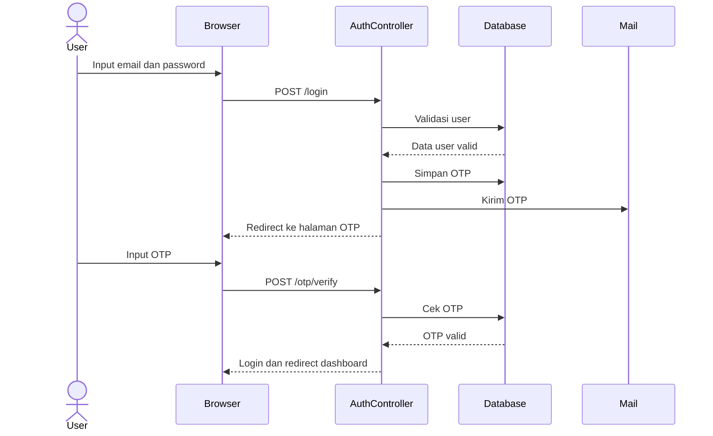

### 3.11.2 Sequence Pengajuan Setoran

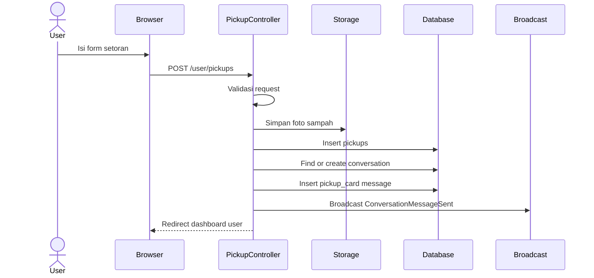

### 3.11.3 Sequence Chat Real-Time

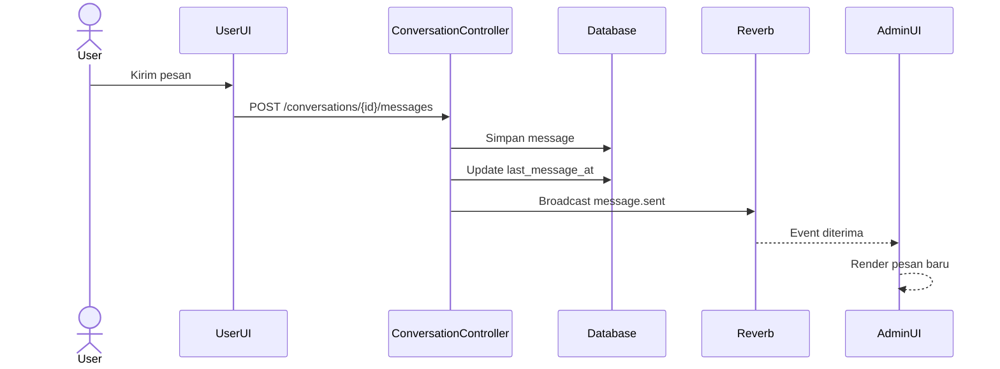

## 3.12 Referensi User Interface

UI EcoDrop menggunakan konsep clean, modern, dan environment-friendly. Warna utama yang digunakan adalah hijau dan emerald untuk menggambarkan lingkungan, kebersihan, dan keberlanjutan.

Referensi tampilan yang digunakan:

1. Dashboard card-based untuk menampilkan statistik dan data ringkas.
2. Table management untuk admin dan super admin.
3. Modal detail untuk melihat data setoran tanpa berpindah halaman.
4. Floating chat widget untuk desktop.
5. Full-screen chat page untuk mobile.
6. Form upload foto dengan preview dan crop pada profile.
7. Status chip untuk status pending, approved, rejected, handled, dan closed.
8. Gradient header dan soft shadow untuk memberi tampilan modern.

Halaman utama yang perlu dimasukkan ke laporan:

1. Landing page EcoDrop.
2. Login user.
3. Register user.
4. OTP login.
5. Forgot password OTP.
6. Dashboard user.
7. Form pengajuan setoran sampah.
8. Riwayat setoran user.
9. Profile edit dan crop foto.
10. Dashboard admin.
11. Detail setoran admin.
12. Dashboard super admin.
13. Admin verification.
14. User management ban/unban.
15. Activity log.
16. Chat floating widget.
17. Chat mobile list.
18. Chat conversation page.

## 3.13 Tech Stack

| Layer | Teknologi |
|---|---|
| Backend | PHP 8.2+, Laravel 12 |
| Frontend | Blade, Tailwind CSS, Alpine.js |
| Authentication | Laravel Breeze, Session Auth, OTP Email |
| Database | MySQL atau MariaDB |
| ORM | Laravel Eloquent |
| Realtime | Laravel Reverb, Laravel Echo, Pusher JS |
| Build Tool | Vite |
| HTTP Client Frontend | Axios |
| Email | Laravel Mailable dan Queue |
| File Upload | Laravel Storage public disk |
| Testing | PHPUnit |
| Package Manager PHP | Composer |
| Package Manager JS | npm |
| Version Control | Git dan GitHub |

---

# BAB IV
# IMPLEMENTASI

## 4.1 Struktur Project

Struktur project EcoDrop mengikuti struktur Laravel.

```text
ecodrop-web/
├── app/
│   ├── Events/
│   │   └── ConversationMessageSent.php
│   ├── Http/
│   │   ├── Controllers/
│   │   │   ├── AdminController.php
│   │   │   ├── ConversationController.php
│   │   │   ├── ForgotPasswordOtpController.php
│   │   │   ├── MessageController.php
│   │   │   ├── PickupController.php
│   │   │   ├── ProfileController.php
│   │   │   └── SuperAdminController.php
│   │   ├── Middleware/
│   │   │   ├── RoleMiddleware.php
│   │   │   └── UpdateLastSeen.php
│   │   └── Requests/
│   ├── Mail/
│   │   ├── AdminVerifiedMail.php
│   │   └── OtpMail.php
│   └── Models/
│       ├── ActivityLog.php
│       ├── Conversation.php
│       ├── ConversationMessage.php
│       ├── Message.php
│       ├── OtpCode.php
│       ├── Pickup.php
│       ├── Reward.php
│       └── User.php
├── database/
│   ├── migrations/
│   └── seeders/
├── resources/
│   ├── css/
│   ├── js/
│   └── views/
│       ├── admin/
│       ├── auth/
│       ├── components/
│       ├── emails/
│       ├── layouts/
│       ├── profile/
│       ├── superadmin/
│       ├── chat-list-new.blade.php
│       ├── conv-chat.blade.php
│       ├── dashboard.blade.php
│       └── welcome.blade.php
├── routes/
│   ├── auth.php
│   ├── channels.php
│   └── web.php
├── tests/
├── composer.json
├── package.json
└── vite.config.js
```

## 4.2 Lingkungan Pengembangan

Lingkungan pengembangan yang digunakan:

1. Sistem operasi: Windows.
2. Local server: Laragon.
3. Backend runtime: PHP 8.2 atau lebih baru.
4. Framework: Laravel 12.
5. Database: MySQL atau MariaDB.
6. Frontend build: Node.js dan npm.
7. Package PHP: Composer.
8. Editor: Visual Studio Code.
9. Browser testing: Google Chrome atau browser modern lain.
10. Version control: Git dan GitHub.

Perintah instalasi dasar:

```bash
composer install
npm install
cp .env.example .env
php artisan key:generate
php artisan migrate --seed
npm run dev
php artisan serve
```

Perintah untuk realtime dan queue:

```bash
php artisan reverb:start
php artisan queue:work
```

Perintah build production:

```bash
npm run build
```

## 4.3 Screenshot Commit dan Repository

Bagian ini diisi dengan screenshot repository GitHub dan commit history.

Checklist screenshot:

1. Halaman repository GitHub EcoDrop.
2. Branch utama atau main branch.
3. Commit awal project Laravel.
4. Commit implementasi auth dan OTP.
5. Commit implementasi dashboard user.
6. Commit implementasi dashboard admin.
7. Commit implementasi dashboard super admin.
8. Commit implementasi chat real-time.
9. Commit implementasi profile photo crop.
10. Commit final UI improvement.

Contoh caption:

Gambar 4.1 Repository GitHub EcoDrop  
Gambar 4.2 Riwayat commit pengembangan EcoDrop  
Gambar 4.3 Commit fitur chat real-time  
Gambar 4.4 Commit finalisasi UI dashboard dan profile  

## 4.4 Screenshot Web App

Screenshot web app yang direkomendasikan:

1. Landing Page  
   Menampilkan identitas aplikasi EcoDrop, deskripsi singkat, CTA login/register, dan konsep platform manajemen sampah.

2. Register User  
   Menampilkan form pendaftaran user baru.

3. Login User  
   Menampilkan form login user dengan email dan password.

4. OTP Login  
   Menampilkan halaman input OTP yang dikirim ke email.

5. Dashboard User  
   Menampilkan informasi poin, form setoran, dan riwayat setoran user.

6. Form Setoran Sampah  
   Menampilkan input jenis sampah, berat, tanggal, alamat, nomor telepon, foto, catatan, dan lokasi.

7. Riwayat Setoran User  
   Menampilkan daftar setoran dengan status pending, approved, atau rejected.

8. Edit Profile  
   Menampilkan data profil dan fitur upload foto profil.

9. Crop Foto Profil  
   Menampilkan fitur penyesuaian foto sebelum disimpan.

10. Dashboard Admin  
   Menampilkan data seluruh setoran, filter, detail setoran, approve, reject, dan delete.

11. Detail Setoran Admin  
   Menampilkan foto user, foto setoran, alamat, lokasi, catatan, dan status.

12. Dashboard Super Admin  
   Menampilkan monitoring sistem, data admin, data user, setoran, dan activity log.

13. Verifikasi Admin  
   Menampilkan admin pending yang dapat diverifikasi.

14. User Management  
   Menampilkan fitur ban dan unban user.

15. Floating Chat Widget  
   Menampilkan chat real-time di desktop.

16. Chat List Mobile  
   Menampilkan daftar percakapan pada mobile.

17. Chat Conversation  
   Menampilkan bubble chat, pickup card, dan status percakapan.

## 4.5 Unit Testing

EcoDrop menggunakan PHPUnit sebagai testing framework bawaan Laravel. Pada folder tests sudah tersedia beberapa test bawaan Laravel Breeze seperti:

1. AuthenticationTest
2. RegistrationTest
3. PasswordResetTest
4. PasswordUpdateTest
5. PasswordConfirmationTest
6. EmailVerificationTest
7. ProfileTest
8. ExampleTest

Perintah menjalankan test:

```bash
php artisan test
```

Rekomendasi test case tambahan untuk fitur EcoDrop:

| No | Modul | Test Case | Expected Result |
|---|---|---|---|
| 1 | Auth | User register dengan data valid | Akun user dibuat |
| 2 | Auth | Login dengan password salah | Login ditolak |
| 3 | Auth | OTP valid | User berhasil masuk |
| 4 | Auth | OTP expired | Sistem menampilkan error |
| 5 | Role | User akses dashboard admin | Ditolak 403 |
| 6 | Role | Admin belum verified login | Ditolak dan diarahkan ke admin login |
| 7 | Pickup | User membuat setoran valid | Data pickup status pending |
| 8 | Pickup | Upload foto selain gambar | Validasi gagal |
| 9 | Pickup | Admin approve setoran | Status approved dan poin bertambah |
| 10 | Pickup | Admin reject setoran | Status rejected |
| 11 | Activity Log | Admin approve setoran | Activity log tercatat |
| 12 | Super Admin | Verify admin | is_verified menjadi true |
| 13 | Super Admin | Ban user | is_banned berubah |
| 14 | Chat | User kirim pesan | Pesan tersimpan |
| 15 | Chat | Admin handle chat | Conversation assigned ke admin |
| 16 | Chat | Dua admin handle chat sama | Salah satu menerima conflict |
| 17 | Profile | Upload crop photo | Foto profil tersimpan |
| 18 | Profile | Delete photo | Foto profil dihapus |

Contoh kerangka feature test untuk pickup:

```php
public function test_user_can_create_pickup(): void
{
    $user = User::factory()->create(['role' => 'user']);

    $response = $this->actingAs($user)->post('/user/pickups', [
        'type' => 'Plastik',
        'weight' => 2.5,
        'pickup_date' => now()->addDay()->format('Y-m-d'),
        'address' => 'Alamat pengujian minimal sepuluh karakter',
        'phone' => '081234567890',
        // photo menggunakan UploadedFile::fake()->image(...)
    ]);

    $response->assertRedirect(route('user.dashboard'));
}
```

## 4.6 Team Development

Tabel tim pengembang dapat disesuaikan dengan anggota kelompok sebenarnya.

| Nama | Role | Tanggung Jawab |
|---|---|---|
| Yoga Gusti R | Full Stack Developer | Backend Laravel, database, routing, dashboard, integrasi fitur |
| M Vicky Haikal | Frontend Developer | UI Blade, Tailwind CSS, responsive layout |
| Thomas Setiawan | UI/UX Designer | Desain antarmuka, referensi visual, layout halaman |

Pembagian kerja yang direkomendasikan untuk laporan:

1. Project manager: mengatur pembagian tugas dan timeline.
2. Backend developer: membuat migration, model, controller, middleware, auth, OTP, dan realtime.
3. Frontend developer: membuat halaman Blade, dashboard, form, table, modal, dan responsive UI.
4. UI/UX designer: membuat desain tampilan, warna, layout, dan pengalaman pengguna.
5. Tester/documentation: melakukan testing manual, mencatat bug, dan menyusun laporan.

---

# BAB V
# PENUTUP

## 5.1 Kesimpulan

EcoDrop adalah aplikasi web manajemen sampah berbasis reward yang dibuat untuk membantu masyarakat mengajukan setoran sampah secara digital. Aplikasi ini memiliki tiga role utama, yaitu user, admin, dan super admin. User dapat membuat setoran, melihat status, mendapatkan poin, mengelola profil, dan menggunakan chat. Admin dapat memverifikasi setoran, memberikan poin, menolak setoran, menghapus setoran, serta menangani chat user. Super admin dapat memverifikasi admin, menghapus admin, ban atau unban user, memantau setoran, dan melihat activity log.

Secara teknis, EcoDrop dibangun menggunakan Laravel, Blade, Tailwind CSS, Alpine.js, MySQL, Laravel Reverb, Laravel Echo, dan Laravel Mailable. Sistem menggunakan arsitektur MVC sehingga struktur aplikasi lebih rapi dan mudah dikembangkan. Database dirancang dengan relasi antara users, pickups, conversations, conversation_messages, otp_codes, activity_logs, rewards, dan messages.

Fitur keamanan juga sudah diterapkan melalui password hashing, CSRF protection, role middleware, OTP login, admin verification, banned user check, dan validasi request. Fitur chat real-time menjadi nilai tambah karena user dan admin dapat berkomunikasi langsung di dalam aplikasi. Dengan adanya activity log, proses verifikasi setoran menjadi lebih transparan dan dapat diaudit.

Berdasarkan implementasi tersebut, EcoDrop dapat menjadi solusi digital yang mendukung pengelolaan sampah yang lebih tertata, transparan, dan menarik bagi masyarakat melalui sistem poin reward.

## 5.2 Saran Pengembangan

Saran pengembangan EcoDrop ke depannya:

1. Menambahkan fitur penukaran reward agar poin user dapat ditukar dengan voucher, saldo, atau hadiah.
2. Menambahkan dashboard statistik berbasis chart untuk total sampah, total poin, dan kategori sampah terbanyak.
3. Menambahkan export laporan ke PDF atau Excel untuk admin dan super admin.
4. Menambahkan integrasi peta yang lebih lengkap untuk melihat lokasi penjemputan.
5. Menambahkan notifikasi browser atau push notification untuk pesan chat dan perubahan status setoran.
6. Menambahkan sistem jadwal petugas atau kurir penjemputan.
7. Menambahkan fitur rating layanan setelah sesi chat atau penjemputan selesai.
8. Menambahkan unit test dan feature test khusus untuk pickup, chat, OTP, dan super admin.
9. Menambahkan pagination server-side untuk data setoran jika jumlah data semakin banyak.
10. Menambahkan API mobile agar EcoDrop dapat dikembangkan menjadi aplikasi Android atau iOS.
11. Menambahkan validasi lokasi agar titik setoran sesuai dengan alamat user.
12. Menambahkan role tambahan seperti petugas lapangan jika sistem dipakai dalam skala besar.

---

# LAMPIRAN

## A. Route Utama

| Method | URL | Keterangan |
|---|---|---|
| GET | / | Landing page |
| GET | /dashboard | Redirect dashboard sesuai role |
| GET | /user/dashboard | Dashboard user |
| POST | /user/pickups | Membuat setoran |
| DELETE | /user/pickups/{id} | Membatalkan setoran pending |
| GET | /admin/dashboard | Dashboard admin |
| GET | /superadmin/dashboard | Dashboard super admin |
| PATCH | /superadmin/admins/{id}/verify | Verifikasi admin |
| DELETE | /superadmin/admins/{id} | Hapus admin |
| PATCH | /superadmin/users/{id}/ban | Ban atau unban user |
| PATCH | /pickups/{id} | Update status setoran |
| DELETE | /pickups/{id}/admin | Hapus setoran oleh admin |
| GET | /profile | Edit profile |
| PATCH | /profile | Update profile |
| POST | /profile/photo | Upload foto profile |
| DELETE | /profile/photo | Hapus foto profile |
| GET | /conversations | Ambil atau buat conversation |
| GET | /conversations/unread/count | Hitung unread message |
| GET | /conversations/{id}/messages | Ambil pesan conversation |
| POST | /conversations/{id}/messages | Kirim pesan |
| POST | /conversations/{id}/handle | Admin handle conversation |
| POST | /conversations/{id}/close | Admin tutup sesi chat |
| POST | /conversations/{id}/reopen | Reopen sesi chat |
| POST | /conversations/{id}/pickup-card/{pickupId} | Kirim pickup card |
| GET | /chat | Halaman daftar chat |
| GET | /conv/{convId} | Halaman conversation chat |
| GET | /login | Login user |
| POST | /login | Proses login user |
| GET | /otp | Halaman OTP user |
| POST | /otp/verify | Verifikasi OTP user |
| GET | /admin/login | Login admin |
| POST | /admin/login | Proses login admin |
| GET | /admin/otp | Halaman OTP admin |
| POST | /admin/otp/verify | Verifikasi OTP admin |

## B. Catatan Nilai Plus Project

Nilai plus EcoDrop yang dapat ditekankan saat presentasi:

1. Sistem sudah multi-role: user, admin, super admin.
2. Admin harus diverifikasi oleh super admin sebelum bisa masuk.
3. Login menggunakan OTP email.
4. Forgot password juga menggunakan OTP.
5. Ada fitur banned user.
6. Ada activity log untuk audit admin.
7. Ada upload foto setoran dan foto profil.
8. Ada crop foto profil sebelum disimpan.
9. Ada chat real-time menggunakan Laravel Reverb dan Echo.
10. Chat memiliki unread count, pickup card, system message, close session, dan race condition protection.
11. Dashboard admin dan super admin memiliki data monitoring.
12. UI sudah responsif untuk desktop dan mobile.

